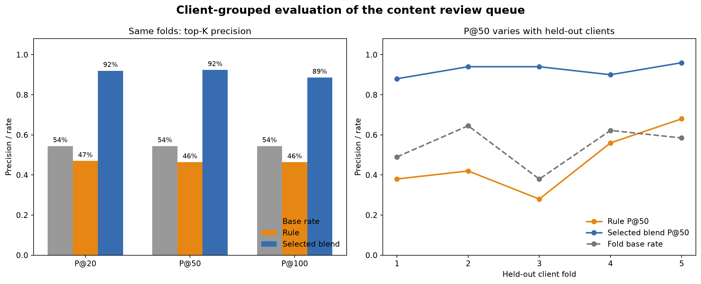
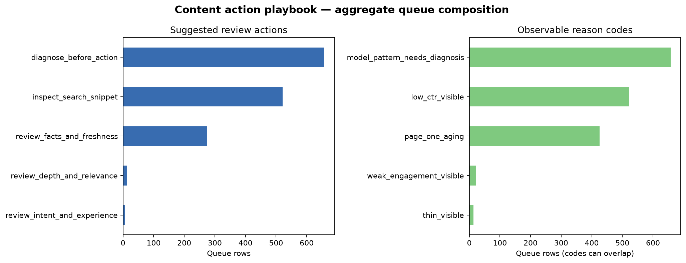

# Can Learning-to-Rank Prioritize Content Decline Reviews Better Than a Fixed Rule?

- **Author:** [lalalostcode](https://github.com/lalalostcode)
- **Lane:** Content decline prioritization / learning-to-rank
- **Repository:** [FlyrankAI_ML](https://github.com/lalalostcode/FlyrankAI_ML)
- **Date:** 31 August 2026

## 0. Abstract

This study asks whether a learned ranking model can prioritize content items showing a current decline signal more precisely than a fixed editorial rule. I used a public-safe FlyRank starter dataset containing 30,000 pseudonymized content items from 32 clients, with trailing-90-day search, engagement, and content metadata. I compared a transparent weighted rule with an equal fold-rank blend of two LightGBM LambdaRank models under five-fold cross-validation grouped by client, while excluding label-derived fields, outcome-window fields, identifiers, and product scores from the model matrix. Across the same held-out folds, the selected blend measured **92.4% ± 3.3% mean precision@50**, compared with **46.4% ± 15.7%** for the rule and a **54.4%** mean fold base rate; its mean ROC-AUC was a more modest **0.643**, so the result is specific to top-of-queue ranking. The output is a decision-support queue that tells an editor what to inspect first, not a future forecast, causal claim, or instruction to edit automatically.

## 1. Problem framing

An editorial team can review only a small fraction of a large content inventory in each cycle. The operational question is therefore not “Can every declining page be classified perfectly?” but **“Which content items should a human inspect first when review capacity is limited?”**

The unit of analysis is one pseudonymized content item. The model output is a relative rank score, converted into a per-client queue with `review_now` (ranks 1–10), `review_next` (11–25), and `monitor` (26–50) tiers. A reviewer checks the page’s time series, search intent, freshness, measurement quality, and business constraints before deciding whether to act.

False positives consume editorial time and can prompt unnecessary changes to stable, valuable pages. False negatives delay the review of items that show an observed decline signal. Machine learning is useful only if it improves the scarce top-of-queue slots under an honest split while leaving the final decision with a person.

## 2. Data safety

### Dataset and grain

The analysis uses `data/raw/content_refresh_anonymized.csv`, the FlyRank internship starter release: **30,000 rows × 44 columns**, one row per pseudonymized content item, across **32 pseudonymous clients**. It contains content metadata and trailing-90-day search and engagement aggregates. The file contains no client names, domains, URLs, page titles, keywords, or raw queries.

The binary proxy target is:

```text
is_declining_label = 1 when trend_direction == "down", else 0
```

`trend_direction == "down"` corresponds to an impression change below −20% between the most recent 30 days and the previous 30 days. The full-snapshot positive rate is **54.2%** (16,262 of 30,000 rows). This is a thresholded observational proxy, not ground truth about content quality or future performance.

### Deliberate exclusions

The following never enter the model matrix:

- label sources: `trend_direction`, `trend_pct`, `is_declining_label`;
- current outcome-window siblings: `impressions_last_30d`, `clicks_last_30d`, `sessions_last_30d`;
- pseudonymous identifiers: `content_id`, `client_id` (grouping and joins only);
- product or prior-system scores: `health_score`, `quick_win`, `needs_attention`, `baseline_refresh_score`, `action_score`.

Rates such as CTR are interpreted on the dataset’s 0–100 percentage scale: `ctr = 0.76` means 0.76%. `avg_position = 0` is treated as missing rank information. Missingness flags are retained for systematically absent fields instead of assuming that every missing value means zero.

No client-identifying data, URLs, or raw queries are printed or exported. The operational queue contains pseudonymous keys so results can be joined back inside an approved environment; the paper uses aggregate metrics only.

## 3. Baseline

The baseline is a transparent score designed before the learned models:

```text
baseline score =
    0.40 × visibility percentile
  + 0.30 × freshness-risk percentile
  + 0.25 × position-opportunity score
  + 0.05 × depth-gap score
```

Its reason codes flag observable conditions such as a stale visible page, page-one aging, low CTR with visibility, thin content with visibility, or weak engagement with measurable traffic. The rule is a fair operational comparator because it produces the same kind of ranked queue from the same snapshot without fitting labels.

On the five fixed client-grouped test folds, the rule measured **46.4% ± 15.7% mean P@50**, below the **54.4% mean fold base rate**. The earlier hand review explained the failure mode: the rule over-prioritized old, high-visibility cornerstone pages even when their observed trend was stable.

## 4. Model and methodology

### Learning-to-rank design

The selected model, `B2_current_rank_blend`, is a fixed 50/50 blend of fold-percentile ranks from two LightGBM LambdaRank models:

1. a base-feature LambdaRank model; and
2. an engineered-feature LambdaRank model.

LambdaRank was chosen because the operational utility is concentrated at the top of a queue rather than in globally calibrated probabilities. LightGBM supplies the boosted-tree implementation. The blend weights were fixed and equal; the score is a relative rank signal, not a probability.

### Exact feature specification

The base matrix contains 18 numeric inputs and one-hot encodings of eight categorical inputs, producing 52 columns in this release.

<details>
<summary>Base numeric and categorical features</summary>

**Numeric (18):** `search_volume`, `competition`, `cpc`, `word_count`, `char_count`, `log_impressions_90d`, `log_clicks_90d`, `log_sessions_90d`, `log_ai_sessions_90d`, `days_with_impressions`, `days_with_sessions`, `content_age_days`, `days_since_last_update`, `ctr`, `avg_position`, `engagement_rate`, `scroll_rate`, `ai_traffic_pct`.

**Categorical (8):** `competition_level`, `content_type`, `main_intent`, `age_tier`, `freshness_tier`, `word_count_tier`, `impression_tier`, `position_tier`.

</details>

The engineered model adds 28 label-free numeric features, producing 80 matrix columns after the same categorical encoding.

<details>
<summary>Engineered numeric features</summary>

`missing_position_flag`, `has_keyword_data`, `has_word_count`, `has_intent`, `has_scroll_rate`, `log_impressions_per_active_day`, `log_clicks_per_active_day`, `log_sessions_per_active_day`, `impression_day_coverage`, `session_day_coverage`, `visibility_x_staleness`, `position_x_visibility`, `engagement_x_sessions`, `content_depth_per_visibility`, `client_impressions_percentile`, `client_impressions_delta`, `client_clicks_percentile`, `client_clicks_delta`, `client_sessions_percentile`, `client_sessions_delta`, `client_ctr_percentile`, `client_ctr_delta`, `client_position_percentile`, `client_position_delta`, `client_staleness_percentile`, `client_staleness_delta`, `client_engagement_percentile`, `client_engagement_delta`.

</details>

Client-relative features use predictor values from the current client inventory and no labels. They fit the batch-ranking use case but would require stored client statistics for single-item inference.

### Validation and leakage checks

All final comparisons use the same five `GroupKFold(client_id)` splits. Each client appears in exactly one test fold and never appears in that fold’s training data. This tests transfer to unseen clients within the same snapshot and blocks row-level client memorization.

The experiment used fixed seed 42, out-of-fold scores only, explicit forbidden-column assertions, one-to-one row alignment checks, and a deliberate confession test in which adding `trend_pct` caused the model score to spike as expected. A previous-window feature family was rejected after it combined with overlapping 90-day totals to partially reconstruct the label and produced implausibly near-perfect top-K results.

## 5. Evaluation and results

### Same folds, same rows, same metrics

| Method | Mean P@20 | Mean P@50 | P@50 SD | Mean P@100 | Mean ROC-AUC | Mean AP |
|---|---:|---:|---:|---:|---:|---:|
| Mean fold base rate | 54.4% | 54.4% | 11.0% | 54.4% | 50.0% | 54.4% |
| Transparent rule | 47.0% | 46.4% | 15.7% | 46.4% | 0.600 | 0.596 |
| Selected rank blend | **92.0%** | **92.4%** | **3.3%** | **88.6%** | **0.643** | **0.684** |

At K=50, the selected blend showed a **+46.0 percentage-point** difference from the rule and a **+38.0pp** difference from the mean fold base rate. Its mean fold lift@50 was **1.76×**. These numbers support a top-of-queue prioritization claim; the 0.643 ROC-AUC shows that the model is not uniformly strong across the entire inventory.



*Takeaway: the selected blend consistently improved the scarce top-of-queue slots, while its whole-ranking discrimination remained moderate.*

### Fold variation and error interpretation

The selected model’s fold P@50 values were **88%, 94%, 94%, 90%, and 96%**. The lowest fold contained one large held-out client, while the other folds held out seven or eight clients. This variation indicates sensitivity to client composition even though the top-50 result was strong in every fold.

Errors are expected when contemporaneous aggregate levels cannot distinguish a true content problem from seasonality, brand demand, a campaign change, a measurement issue, or an evergreen page. The model score therefore does not explain a decline; reason codes are separate, observable review prompts.

### Negative and marginal results

The experiment did not hide failed upgrades. ExtraTrees was the strongest pure second-generation classifier at 88.4% mean P@50. Conventional stacking reached 89.6%; cross-fitted adaptive blending and hierarchical calibration both failed to improve the 92.4% benchmark. The best advanced candidate reached **92.8% ± 2.3%**, only **+0.4pp** over the selected model and below the predeclared +5pp target. Because that candidate was selected on the same development folds, it remains in shadow status.

## 6. Interpretation

The central pattern is operational: optimizing a ranking objective and blending complementary base and engineered rankers improved the first 50 review slots much more than adding increasingly complex classifiers. Engineered features contributed missingness awareness, intensity per active day, visibility–freshness interactions, and within-client context, but the ranking objective accounted for most of the gain in the earlier ablation.

This should not be interpreted as evidence that old pages, low CTR, or any other feature causes decline. Feature importance and reason codes identify associations and review context. The result says that, in this snapshot and under client-grouped validation, the model ordered the threshold label effectively near the top of the list.

The negative ensemble experiments also matter: repeated selection against the same 30,000-row snapshot produced only a marginal ceiling. The next credible path is new temporal information—pre-cutoff slopes, volatility, seasonality, and multiple forecast origins—not further tuning on the same folds.

## 7. Ranked recommendations

The action playbook exports **1,473 rows across 32 pseudonymous client groups** because some groups contain fewer than 50 items. It contains 313 `review_now`, 465 `review_next`, and 695 `monitor` rows.

1. **Start with ranks 1–10 inside each client group.** Treat these as review priority, not automatic action.
2. **Use reason codes to choose the inspection.** Check snippet/intent for `low_ctr_visible`, coverage for `thin_visible`, factual freshness for `stale_visible`, and measurement or UX for `weak_engagement_visible`.
3. **Diagnose model-only picks.** `model_pattern_needs_diagnosis` means the model ranked the item highly without a simple threshold explanation.
4. **Record the decision separately.** Capture `act`, `defer`, or `no_action`, the evidence reviewed, and any actual intervention. Do not recycle editor choices as labels without a new design.
5. **Pause on sustained drift.** Investigate if P@50 falls below 82.4%, missingness shifts by more than 5pp, action mix shifts by more than 15pp, or label base rate shifts by more than 10pp. Two consecutive performance alerts pause model-led ordering.



*Takeaway: most queued items require diagnosis or snippet review; only a small minority receive a depth or engagement prompt.*

### No-go actions

Never edit, expand, unpublish, redirect, change canonicals, contact a client, evaluate staff, or promise traffic impact from this score alone. Never treat the rank score as a probability or causal explanation. New periods and populations require shadow deployment and fresh grouped or temporal validation.

## 8. Reproducibility

### Core artifacts

- [`work/notebooks/w04_baseline_score.ipynb`](notebooks/w04_baseline_score.ipynb) — transparent rule and baseline queue
- [`work/notebooks/w06_feature_engineering.ipynb`](notebooks/w06_feature_engineering.ipynb) — ranking-objective ablation
- [`work/notebooks/w06_feature_engineering_v2.ipynb`](notebooks/w06_feature_engineering_v2.ipynb) — selected equal-rank blend
- [`work/notebooks/w06_advanced_ensembles.ipynb`](notebooks/w06_advanced_ensembles.ipynb) — advanced candidates and negative results
- [`work/notebooks/w07_action_playbook.ipynb`](notebooks/w07_action_playbook.ipynb) — operational queue and monitoring policy
- [`work/notebooks/capstone.ipynb`](notebooks/capstone.ipynb) — paper receipts and final figures
- [`work/outputs/advanced_ranking_results.json`](outputs/advanced_ranking_results.json) — selected-model fold metrics
- [`work/outputs/action_playbook_metrics.json`](outputs/action_playbook_metrics.json) — aggregate operational receipt
- [`work/scripts/action_playbook.py`](scripts/action_playbook.py) — queue construction and export guards

### Fresh-clone commands

From the repository root:

```bash
python -m venv .venv
# Windows: .venv\Scripts\activate
# macOS/Linux: source .venv/bin/activate
python -m pip install -r requirements.txt lightgbm==4.7.0 xgboost==3.4.1

python scripts/01_prepare_features.py
python work/scripts/execute_notebook.py work/notebooks/w04_baseline_score.ipynb
python work/scripts/feature_engineering_experiment.py
python work/scripts/feature_engineering_v2_experiment.py
python work/scripts/advanced_ranking_experiment.py
python work/scripts/execute_notebook.py work/notebooks/w07_action_playbook.ipynb
python work/scripts/execute_notebook.py work/notebooks/capstone.ipynb
```

Optional negative-result probes are `stacking_probe.py`, `advanced_blend_search.py`, and `hierarchical_calibration_probe.py` in `work/scripts/`.

The reported environment used Python 3.13.9, pandas 3.0.3, NumPy 2.5.1, scikit-learn 1.9.0, LightGBM 4.7.0, and XGBoost 3.4.1. All model experiments use random seed 42. CSV queues are intentionally gitignored as dataset-like artifacts; aggregate JSON receipts, scripts, notebooks, and figures are the commit-safe evidence.

### References

1. Ke, G. et al. (2017). [LightGBM: A Highly Efficient Gradient Boosting Decision Tree](https://proceedings.neurips.cc/paper/2017/hash/6449f44a102fde848669bdd9eb6b76fa-Abstract.html). *Advances in Neural Information Processing Systems 30*.
2. Burges, C. J. C. (2010). [From RankNet to LambdaRank to LambdaMART: An Overview](https://www.microsoft.com/en-us/research/wp-content/uploads/2016/02/MSR-TR-2010-82.pdf). Microsoft Research Technical Report MSR-TR-2010-82.
3. scikit-learn developers. [GroupKFold documentation](https://scikit-learn.org/stable/modules/generated/sklearn.model_selection.GroupKFold.html).

## 9. Acknowledgments and data credit

Built on the [FlyRank ML Internship dataset](https://flyrank.ai). The starter release was deliberately pseudonymized for public-safe learning. Thanks to the FlyRank internship maintainers for the data contract, safety guidance, notebook scaffolds, and emphasis on decision-support claims that match the validation design.

---

### Five-minute demo outline

1. **0:00–0:40 — Decision:** show the limited editorial-review problem and why P@50 is the primary metric.
2. **0:40–1:20 — Data and label:** explain 30,000 items, 32 clients, the threshold proxy, and the forbidden fields.
3. **1:20–2:10 — Honest validation:** show five client-grouped folds and the rule/base-rate comparison.
4. **2:10–3:10 — Result:** show 46.4% rule → 92.4% selected P@50, then immediately show ROC-AUC 0.643 and the limitations.
5. **3:10–4:10 — Action playbook:** demonstrate per-client ranks, reason codes, human review, and no-go actions.
6. **4:10–5:00 — Next experiment:** propose temporal warehouse features and multiple forecast origins; close with reproducibility receipts.

### Social-post cut

I built a client-grouped learning-to-rank system for prioritizing content-decline reviews on 30,000 pseudonymized items. On the same five held-out-client folds, a transparent rule measured 46.4% mean precision@50, while the selected LambdaRank blend measured 92.4% ± 3.3% (mean fold base rate: 54.4%). The important caveat: this is current-snapshot decision support, not future forecasting or proof that an edit will improve traffic. The repo includes the failed experiments, leakage guards, aggregate receipts, and a human-review action playbook.

### Employer-facing summary

I built a reproducible learning-to-rank pipeline and editorial action queue over 30,000 pseudonymized content items from 32 clients. Using five-fold client-grouped validation, the selected model measured 92.4% ± 3.3% precision@50 versus 46.4% ± 15.7% for a transparent rule, while explicit leakage tests and a 0.643 ROC-AUC kept the claim scoped to top-of-queue prioritization. I translated the model into review reason codes, no-go automation rules, drift thresholds, and commit-safe JSON receipts so another analyst can audit and rerun the work.
